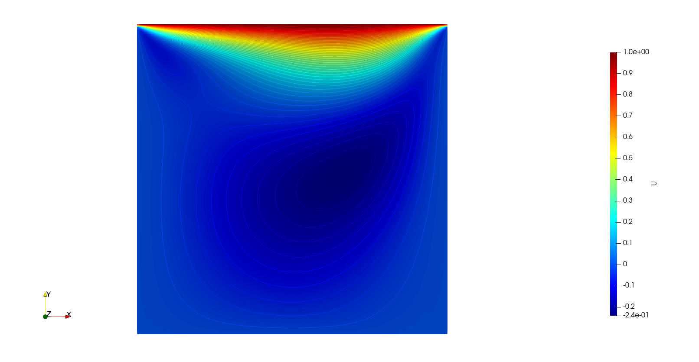

# ACM
Implementation of artifical compressiblity method in C. Thanks to Tanmay agrawal for his CFD lecture about this method (also took part of his code for visualisation in plt format). Also refer to "A numerical method for solving incompressible viscous flow problems" by chorin 1967 for futher explanation on Artificial Compressibility Method.

# The Contour plot obtained from the cavity problem with U=1.0m/s

